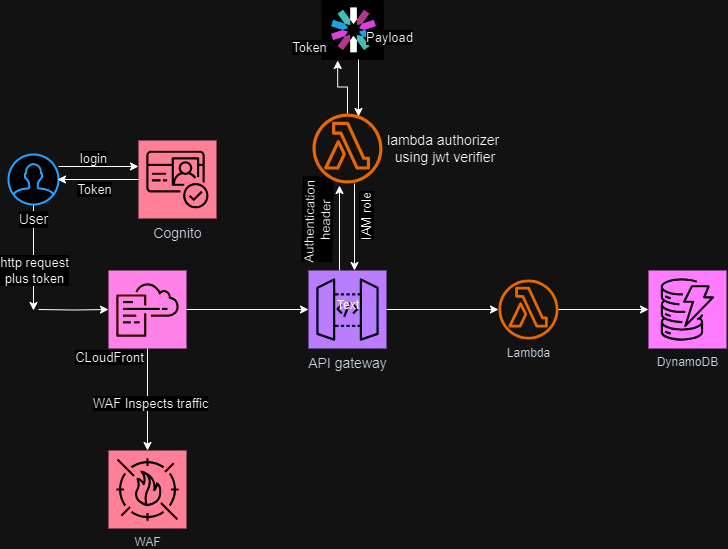

# Buld and Deploy a Secure application with AWS serverless services using serverless framework

Authentication is setup for the API and the serverless application is protected by WAF
attched to a cloudFront distribution.

## What are the resources used in this architecture?

Cognito

CloudFront Distro

WAF

API Gateway

Lambda

DynamoDB

IAM

The Diagram below shows the architecture.

